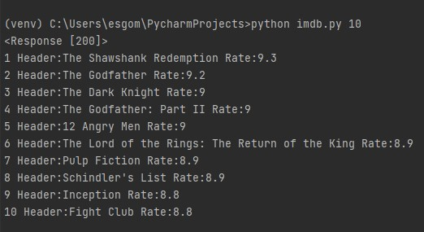

# IMDB_Top_250

Use: python imdb.py <number of top movies to show> on windows terminal
For help: python imdb.py help 
(I forgot how to run from linux)
You can only enter one parameter and parameter must be between 0 and 250
Also you can execute from the an ide but than you cant choose number of movies to be shown

